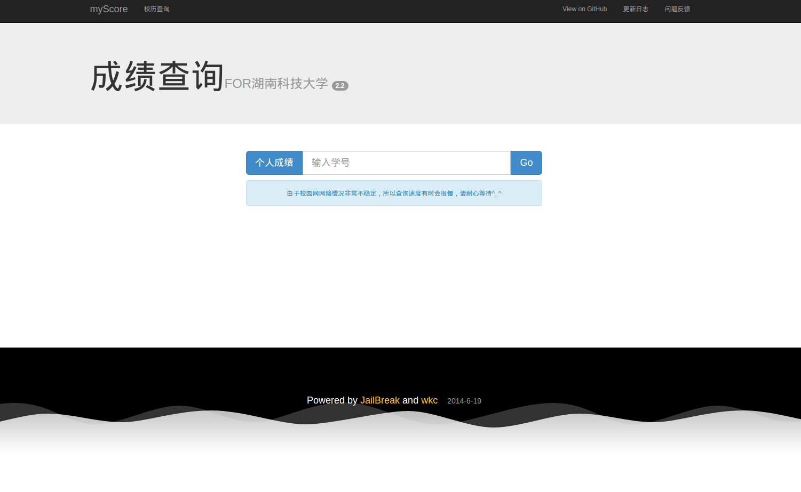
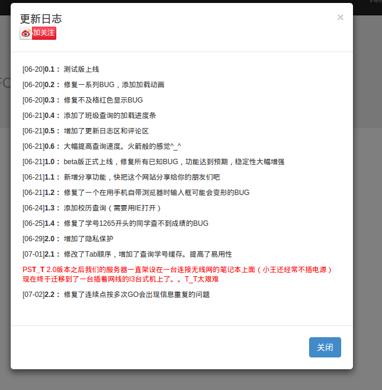
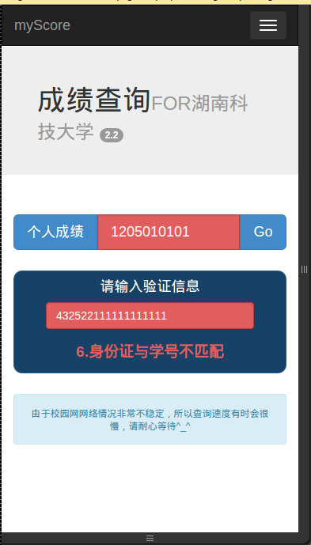
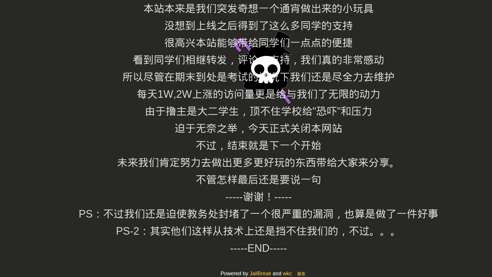

湖南科技大学成绩查询
=====
#####目前我正在寻找暑假实习，欢迎访问 [r.hi-hi.cn](http://r.hi-hi.cn) 查看我的简历

这是一个基于教务网漏洞的成绩查询网站,开发时间约2014年6月,目前该项目已经废弃

作者:[JailBreakC](https://github.com/JailBreakC) [wangkechun](https://github.com/wangkechun)
####请关注我们的微信号 查水表小分队

##技术提要:
- 用财务网某漏洞获取到学生身份证号码,然后在教务网利用家长查询渠道获取成绩信息.
- 用内网映射解决外网服务器无法访问教务网的问题
- 内网映射基于 ssh反向隧道,花生壳,[net123](http://www.nat123.com/)
- 前端页面基于Bootstrap/jQuery/CoffeeScript
- 后端基于Python语言的Flask框架,数据库采用MongoDB
- 爬虫采用Scrapy框架的selector提取信息,用Fabric实现自动同步数据库
- 验证码识别采用PIL,算法是简单的K最近邻算法.

##版本日志
- [06-20] 0.1： 测试版上线
- [06-20] 0.2： 修复一系列BUG，添加加载动画
- [06-20] 0.3： 修复不及格红色显示BUG
- [06-21] 0.4： 添加了班级查询的加载进度条
- [06-21] 0.5： 增加了更新日志区和评论区
- [06-21] 0.6： 大幅提高查询速度。火箭般的感觉^_^
- [06-21] 1.0： beta版正式上线，修复所有已知BUG，功能达到预期，稳定性大幅增强
- [06-21] 1.1： 新增分享功能，快把这个网站分享给你的朋友们吧
- [06-21] 1.2： 修复了一个在用手机自带浏览器时输入框可能会变形的BUG
- [06-24] 1.3： 添加校历查询（需要用IE打开）
- [06-25] 1.4： 修复了学号1265开头的同学查不到成绩的BUG
- [06-29] 2.0： 增加了隐私保护
- [07-01] 2.1： 修改了Tab顺序，增加了查询学号缓存。提高了易用性
- PS T_T   2.0版本之后我们的服务器一直架设在一台连接无线网的笔记本上面（小王还经常不插电源）
- 现在终于迁移到了一台插着网线的I3台式机上了。。T_T太艰难
- [07-02] 2.2：   修复了连续点按多次GO会出现信息重复的问题

##项目介绍
文章来自 http://vgee.cn/#/post/2014-09-18-about-myscore.md
#####title:科大成绩查询网开发过程
#####disc:参加微知著奖学金评选要的材料，挑了这个项目来写一写
#####type:项目经历
在大二下学期期末考试的前两天，我正在努力的做期末考试的复习，休息的时候点开教务网，查看考试安排，忽然想起教务网（内网）在家里没法正常访问，而且只兼容IE8-浏览器，。于是萌生了一个想法，自己做一个成绩查询的网站，这样再也不用进恶心的教务网。简直造福广大师生啊。

然后我就和王克纯（实验室同学）商量了一下，发现他也正有此意，于是我们两一拍即合，准备共同开发这个网站。我们采用的基本原理是ssh隧道内网穿透. 把教务网映射出去,然后我们还有个digitalocean vps,可以用作服务器。就这样，王负责后端代码编写和隧道、爬虫，我负责前端页面逻辑和数据处理。

- 项目开始前准备：
- 使用-Python做后端开发语言，mongoDB数据库。
-  使用bootstrap做前端框架，使用media query响应式布局
-  使用git作为版本控制工具，github作为数据托管。
-  约定好了json数据接口，手写几组样例数据做调试用。
-  然后两人就快速的开始了开发
-  首页设计的很简洁，采用AJAX动态加载的方式首页只有一个很漂亮的标题和输入框，
-  还有一个用CSS3的canvas制作的一个加载动画，很漂亮。
-  输入学号之后发送请求再加载数据。
-  很快，第一个版本就做出来了。
-  这时候发现数据太多，需要分类一下，
-  于是就做把数据按照学期分组排序、做了几个按钮。
-  试了一下，感觉非常好用。
-  然后我又想到，有时候我们会想要知道全班的成绩分布，
-  为何不写一个全班查询的功能呢。
-  于是马上动手，因为从用户的学号很容易知道他所属的班级
-  我就将整个班级所有的请求发送出去，然后慢慢接收。
-  这样虽然数据量有点大，时间有点长，
-  但是好在可以接受一个显示一个，页面不会卡死。
-  时间一长，进度条还是很有必要的，这个时候遇到一个比较棘手的问题
-  javascript采用的是异步加载的方式，靠代码顺序是没用的。
-  要用回调函数的方式来接收事件的处理状态，由于当时还不是很熟悉
-  折腾了比较长的时间，最后还是解决了。
-  后来就是各种小细节的优化
-  比如给挂掉的科目加上红色背景，增加请求超时提醒
-  还有在小屏幕上的布局优化，等等。
-  这样就基本上可以使用了。然后上线测试，回去休息
-  （这个时候已经到了第二天的早上）
-  但是就这样简单上线了，网站一点灵气都没有。
-  于是我就找来了微博、空间分享的的API添加上分享功能。
-  然后还添加了百度统计的代码，来统计用户数。
-  还做了两个弹出的模态框一个用来给我们留言（使用多说）
-  一个用来显示我们的版本更新日志。
-  在浏览器兼容方面还对IE8做了特殊处理，保证IE8也可以顺畅访问。
-  事实证明这样效果非常好，在网站上线的初期我们就迎来了大量的关注
-  并且有很多同学给我们留言，提建议和互动。
-  就在我们非常开心的看到日访问量到达1万多的时候
-  忽然接到了教务处老师打来的电话，
-  说是由于我们的网站限制太宽松，导致可以随意查看同学成绩，
-  属于侵犯隐私要求我们关闭。
-  没有办法，我们只好把网站暂时关闭，然后马上想解决办法。
-  不过这件事还促使学校修复了一个存在了很久的BUG，
-  就是可以直接通过修改url地址的方式来获取学生的成绩（我们的数据来源）
-  这件事情也在网上导致了同学们的激烈讨论，大部分同学还是认为
-  教务网的做法过激，自己做不好的系统还不让别人做。
-  不过我们没有被困难锁住，马上想好解决方案。
-  直接通过OCR的方式破解了教务网的验证码，直接利用家长查询功能正常登陆
-  又拿到了学生的成绩信息，
-  而且在首页加上了身份证后四位验证，并且阉割掉了全班查询功能。
-  这样我们的又网站得以重新上线，并且在后来的几天达到了1.7万日访问的峰值。
-  一时间几乎科大人都知道有这样一个方便又好用的查成绩方式了。

##使用截图:

  

